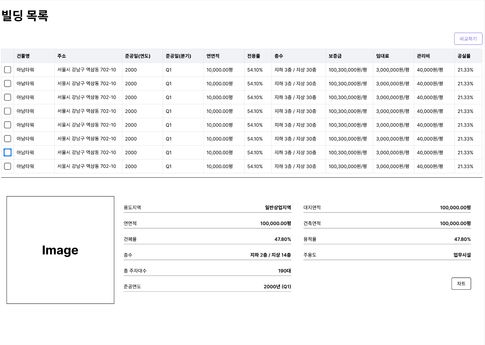

# RSQUARE Front-end 채용 과제

제공된 프로젝트를 바탕으로 아래 조건을 만족하는 웹 페이지를 만들어주세요.

## 저희가 여기까지는 준비해 두었어요

원활한 프로젝트 진행을 위해 다음과 같은 내용들은 저희가 준비해 두었습니다.

1. 편안한 개발을 위해 Rest API를 미리 구성해두었습니다. `/src/MockSamples.js` 컴포넌트를 참고하세요.

2. 스타일 작업을 위한 tailwind를 기본 설정했습니다. 개발하시는데 좀 더 편한 방법이 있으시면 변경하셔도 괜찮습니다.

> `MockSamples` 컴포넌트의 내용만 가지고서도 충분히 Rest 명세를 파악할 수 있다고 판단되어 별도의 API 명세서는 제공하지 않습니다 🙏

## 과제 프로젝트의 스펙은 다음과 같아요

제공된 샘플 이미지를 확인하시고 아래 요구사항을 충족하는 페이지를 만들어주세요.

샘플 이미지는 가이드라인이고, 좀 더 좋은 UI/UX를 고려하신다면 변경하는 것도 환영합니다.

구현하셔야 하는 페이지는 `빌딩목록`과 `빌딩비교` 총 2개 페이지입니다.

### 1. 빌딩 목록 페이지

빌딩 목록 페이지에 적절한 내용을 보여주세요.

빌딩 목록은 `/buildings` API 호출을 통해 확인하실 수 있습니다.

테이블의 Row는 최대 10개까지만 표시될 수 있도록 높이를 설정해주세요. 그 이상의 데이터가 있는 경우, 스크롤이 표시될 수 있으면 좋을 거 같아요.

스크롤을 사용하는 경우, Header는 상단에 고정될 수 있어야 합니다.

#### 빌딩 선택

테이블에서 Row를 클릭하면 해당 빌딩의 상세 정보가 테이블 하단에 표시될 수 있어야 합니다.

빌딩은 단일 선택으로 동작할 수 있어야 합니다. (Checkbox와 Row 클릭은 다른 동작입니다.)

빌딩 상세 정보는 `building/:id` API 호출을 통해 확인하실 수 있습니다.

테이블은 아래 가이드라인을 참고해서 구현해주세요. 디테일한 설정은 편하게 적용해주시면 좋아요!

#### 차트보기

빌딩 상세 정보에서 `차트` 버튼을 클릭해서 일부 항목의 변동값을 확인할 수 있는 Dialog를 구현해주세요.

차트 정보는 `chart/:id` API 호출을 통해 확인하실 수 있습니다.

차트는 지원자분께서 원하시는 라이브러리를 어떤걸 사용해도 괜찮습니다.

왜 구현하신 라이브러리를 선택했는지 설명해주시면 좋을 거 같아요!

#### 빌딩 비교하기

테이블 각 Row의 Checkbox를 사용하여 비교할 빌딩 선택 후, 테이블 우측 상단 `비교하기` 버튼을 클릭하여 선택된 빌딩 정보를 비교할 수 있어야 합니다.

비교하기는 `빌딩비교 페이지`로 이동하여 보여주시면 됩니다.

비교할 빌딩 선택은 최대 `10`개까지만 가능할 수 있도록 설정해주세요.

### 2. 빌딩 비교 페이지

선택된 빌딩 정보를 비교하여 확인할 수 있는 페이지를 구현해주세요.

선택된 빌딩이 화면에 모두 표시되지 않는 경우, 스크롤을 사용할 수 있도록 구현해주세요.

각 Column의 값은 빌딩들의 값을 비교하여 `최대`, `최소` 값을 다른 UI로 표시될 수 있도록 해주세요.

빌딩 비교 페이지에서 빌딩 목록 페이지로 이동했을 때, 선택된 빌딩은 유지될 수 있어야 합니다.

## 그 외의 공통 스펙

위 정리된 세부 스펙 이외에 공통 스펙은 다음과 같습니다.

0. 꼭꼭꼭 프로젝트에 README.md를 작성해주세요. 정해진 양식 없이 자유롭게 작성해주시면 됩니다.
1. 금액 표시는 `1,000원` 형태로 화면에 보여주세요.
2. 저희가 다루는 금액은 꽤나 큰 단위에요. 숫자가 `만`, `억` 단위가 넘어가는 경우는 `1000만원`, `10억 4000만원` 과 같이 표시될 수 있도록 해주세요.
3. 금액이 없는 데이터라면, 기본값은 0원입니다.

## 개발하실 때, 아래 내용을 참고해주세요.

1. 라이브러리 사용에 제한이 있나요? API 호출은 fetch API만 사용해서 해야 할까요?
   - A: 라이브러리 사용에는 어떠한 제한도 없습니다. API 호출 등 필요한 모든 경우에 원하시는 라이브러리를 사용하시면 됩니다.
2. 자바스크립트와 타입스크립트 중 어떤 것을 사용해야 할까요?
   - A: 타입스크립트를 선호합니다. 다만 지원자님의 상황에 따라 결정하실 수 있도록 기본 코드는 자바스크립트로 제공해드립니다.
3. 다른 디자인 요소를 추가해도 될까요?
   - A: 일부 UI 요소는 지원자분께서 어떻게 고민하시는지를 궁금하여 추가한 내용들이 있습니다. 그 외에도 필요하시면 당연히 디자인 요소를 추가하시는 것을 환영합니다.
4. DOM 구조나 스타일 구조를 바꿔도 될까요?
   - 편하신대로 수정해가시면서 과제를 진행하셔도 되고, 저희가 제공드린 화면과 완전히 다른 새로운 구성의 화면으로 구성되어도 괜찮습니다.

## 과제 리뷰는 아래 내용을 고민하며 진행합니다.

저희가 지원자님의 과제를 통해 보고싶은 내용은 다음과 같습니다.

1. 지원자님께서 README에 프로젝트에 대한 내용을 어떻게 정리하시는지에 대한 관심이 많습니다. **현재 보고 계신 README.md를 삭제하시거나 이름을 바꾸신 뒤, 이 프로젝트에 대한 README를 작성해주세요.**
2. 지원자님께서 익숙하신 React Project의 구조를 보고 싶습니다. 평소 프로젝트를 진행하실때 사용하시는 기본적인 설정 및 폴더 구조 등을 적극적으로 활용해주세요.
3. 사용자 경험 및 퍼포먼스를 고려한 React Application 작성이 가능하신지를 보고 싶습니다. 사용자 경험과 퍼포먼스를 고려한 구현 및 설계라면 모든 부분에 대해 환영입니다. 만약 사용자 경험과 퍼포먼스를 고려한 특별한 구현이 있으시다면 Readme나 주석을 통해 충실히 알려주세요. 그 부분은 더 자세히 살펴볼 수 있도록 하겠습니다.
4. 화려한 디자인 요소들을 고민하는 것도 좋지만, 화면 사이즈나 Contents에 따라 깨지지 않는 UI를 고려해주시면 좋습니다. 디자인은 디자이너분께서 해주시지만, 사용자에게 올바른 화면을 제공하는 것을 FE가 신경쓰는 일이라고 생각해요.

## 저희의 평가 환경은 이렇습니다

- 저희는 README를 꼼꼼하게 봅니다.
- 저희는 코드리뷰 및 `npm run start`를 통해 구동한 개발 서버를 구글 크롬을 통해 확인하는 방식으로 평가를 진행합니다. 구글 크롬 이외의 다른 브라우저는 고려하지 않으셔도 됩니다.

---

과제 진행 과정에서 궁금한 사항이 생기셨다면 채용 담당자에게 편하게 질문 부탁드립니다. 성실히 답변드리도록 하겠습니다.

-RSQUARE Frontend Team-
